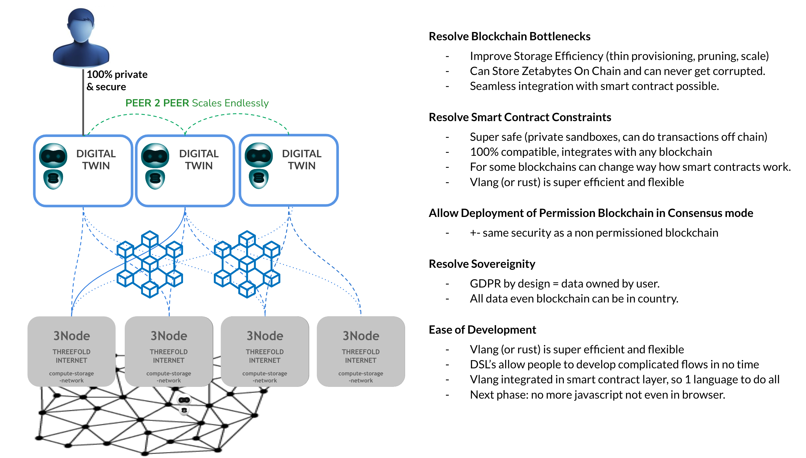
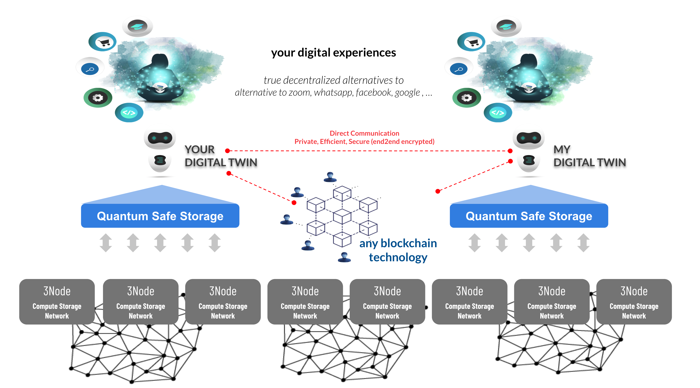

  

Web 4 is a new concept which is the combination of Web 3 (blockchain) and digital twin technology.

Its a concept with many advantages like

- less power usage
- more scalability
- more flexibility
- faster development
- more security

### Architecture Intro

  

**Specific for storage, there are some cool features:**

Each twin has its own storage system where data cannot be lost or corrupted. Each twin decides for itself where the data will be stored.

