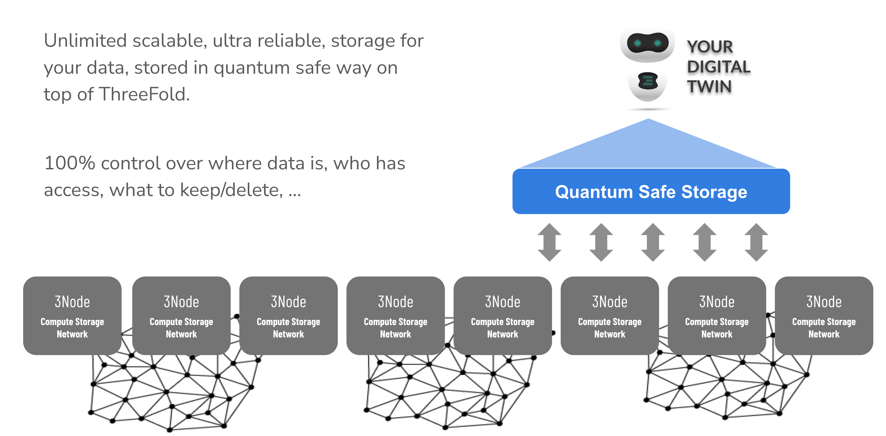

## Web 4 unique storage architecture 

  

Each Digital Twin can now store data which can never be lost or corrupted.

- This is not based on replication or blockchain!
- Data is distributed over multiple 3nodes in such a way that not even a quantum computer can hack it. 
- The data is 100% owned by the owner and zero-knowledge proof to the the TFGrid.
- This concept scales unlimited.

