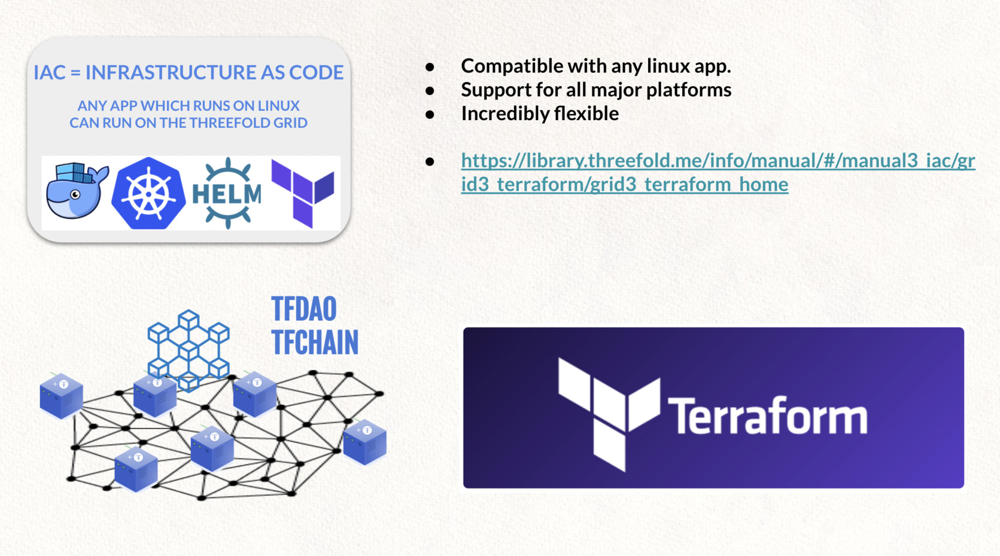
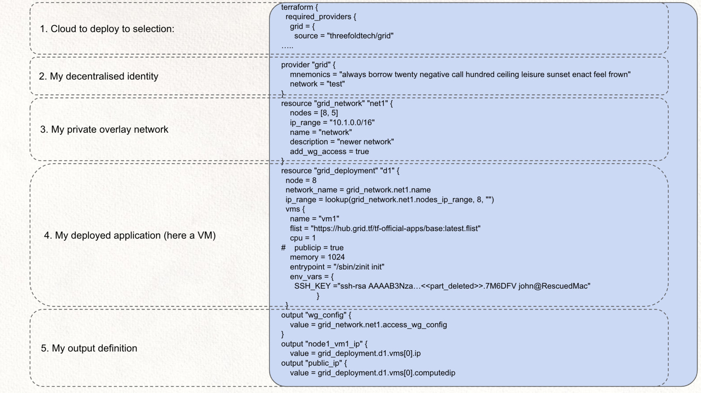
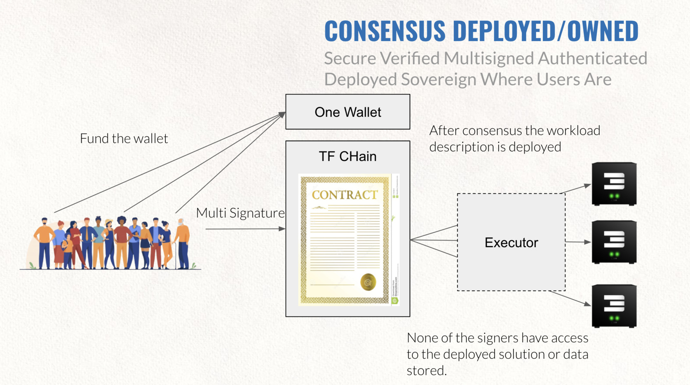
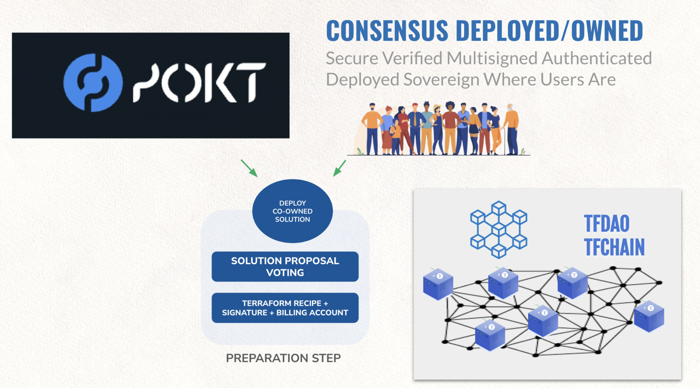

## Executor TERRAFORM 

> Terraform is a mechanism on how to deploy IT workloads in a reproducible and safe way.

A terraform script has multiple parts and can get deployed by an executor.

See the ThreeFold Technology book to learn more about how to use smarts contracts for IT and deploy any workload.

### Consensus Owned & Deployed Solutions

<!-- ### Example with Pokt.Network

 -->

> Coming H1 2023