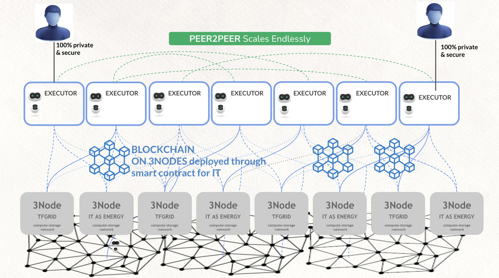

## From Client Server to Peer2Peer

Peer2peer is the most decentralized way to experience our digital life.

- all executors talk to each other over private secure links
- there is no blockchain involved for the compute, storage & network requirements.
- each executor needs compute, network and storage resources this is managed by L0 Validators.
- The executor (web4 or twin) is the only entity who has control over the resource it requires, its all 100% private and fully peer2peer.
  