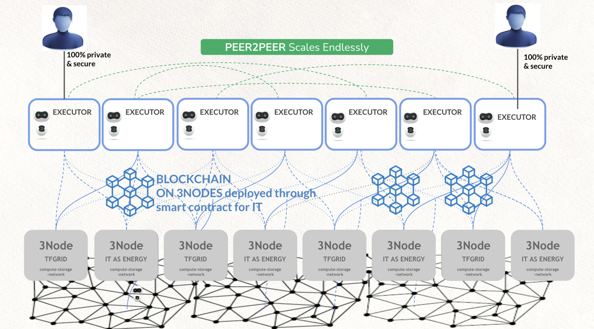

# ThreeFold executors

Executors are like digital twins but they are not linked to one specific person, they are stateless and can work on our behalf for any specific usecase and/or any pre-implemented. Some would call it our approach to serverless functions.

Peer2peer is the most decentralized way to experience our digital life.

- all executors talk to each other over private secure links
- there is no blockchain involved for the compute, storage & network requirements
- each executor needs compute, network and storage resources, this is managed by L0 Validators
- The executor (web4 or twin) is the only entity who has control over the resource it requires, its all 100% private and fully peer2peer

<!-- {{#include executors_usecases.md}} -->