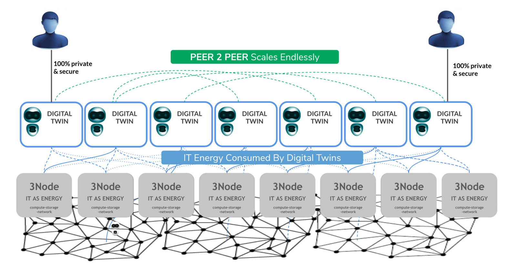

## Ultimate Scale Out Capabilities

Peer2peer is the most decentralized way to experience our digital life

- each user has a digital twin
- this twin serves your complete digital life
- the digital twin represents you and has all logic required to act on your behalf
- all digital twins talk to each other over private secure links
- there is no blockchain involved for the compute, storage & network requirements
- each digital twin needs compute, network and storage resources to survive, the twin will use TFT to reserve and pay for these resources as used on the ThreeFold Grid
- The twin is the only entity who has control over the resources it requires, it is all 100% private and no blockchain involved to reserve and use that capacity