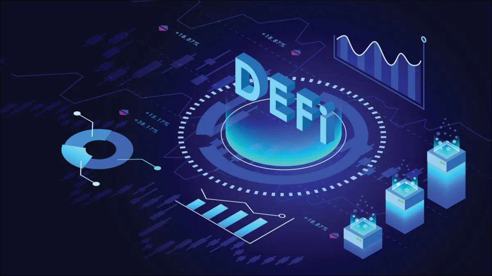

# DeFi and Peer To Peer Exchange

DeFi is an amazing trend which banks should try to leverage, if not for internal usage, to provide a more transparent and safer way for their customers to exchange their currencies (digital and fiat) in a fully regulated environment.

We have all the building blocks available to make this work.

Thanks to the digital twin this is implemented in a fully peer2peer way, while using DeFi Smart Contracts on the blockchain.