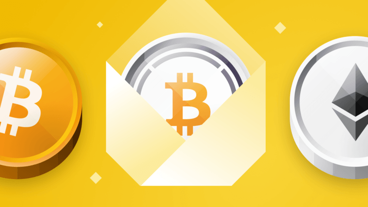

# Digital Currency Wrapping

In Addition to allowing a user to directly integrate with an outside digital currency, we also suggest allowing wrapping of the outside currencies e.g. a wrapped BitCoin (BTC).

This Wrapped BTC is then stored on the main or dedicated digital currency chain (can even be one chain per wrapped asset). The IBC (see below) allows the wrapped BTC to be used by the user from their wallet and digital twin.

The Original BTC is stored offline in the Knox Security Vault using our Quantum Safe Storage Codec. This allows for ultimate security and flexibility for users.

The bank can choose to allow users to exchange digital currencies with the external world or not, through IBC (Inter Blockchain Protocol, see below), this can be easily achieved. The bank can even choose to become a liquidity provider for the existing digital currency world (optional).

Revolut, for example, has chosen to keep the digital currencies in their internal system, and the user can only exchange from their own fiat currency to the digital currency and back. We believe though that it's nicer to allow the user to exchange digital currencies with the outside world if it matches the Bank’s Regulatory requirements.

It is possible to introduce multiple stages e.g. in the digital bank ecosystem, users can freely exchange currencies with each other (stays on chain). Once they want to go off chain, extra checks are done to make sure there is no fraud involved, it can then take a certain time before it executes.