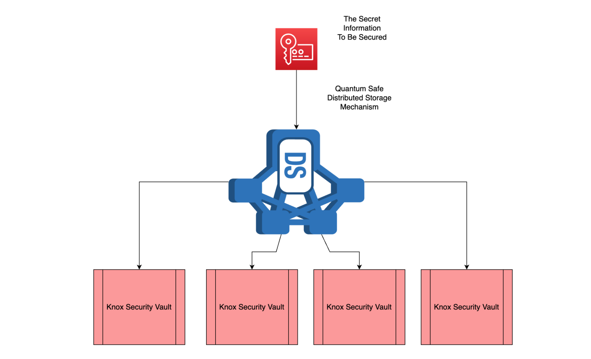

# Knox Security Vault

The ability to use multiple secure areas which can be used to provide offline storage of keys and digital currency cold wallets.

Each Knox Security Vault is an ultra safe area. Thanks to our Quantum Safe Storage system, it is not possible to retrieve a key even if a hacker would be in one safe, as a combination of three safes is required to recover information.

We suggest using the key storage in the following way: each wallet from a user stores the encrypted dispersed key distributed over four or five Knox Security Vaults. Only in the case of a disaster and user strong identification, an user could get access (in the case of death of the customer, to hand-over to the relatives).