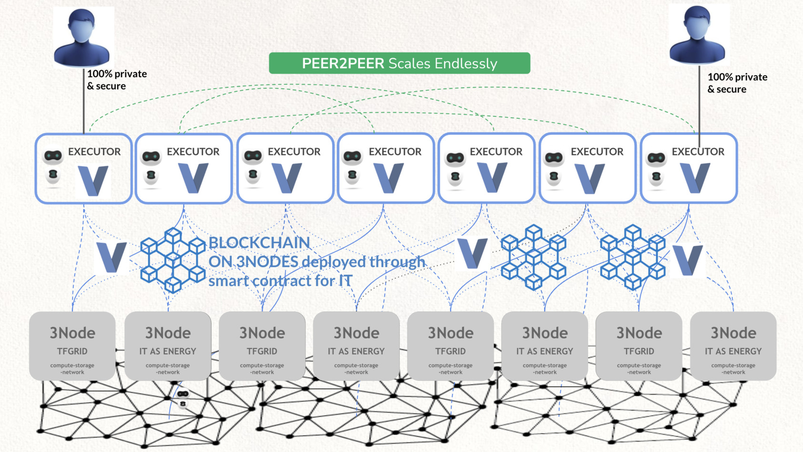

# Executor VLANG 

VLang is an exciting language sponsored by ThreeFold. VLang has 27000 github stars and we believe its a very good language to build executor functions with.

Why did we choose vlang as a first language to support on the TF Executors?

- Its a very fast language (minimal energy & cpu footprint)
- Its easy to learn
- It compiles very fast

### Utilization

- As smart contract language inside cosmos layer (L1).
- As provisioning layer for TFGrid
- As serverless function layer for Executors (super exciting)

> Coming H2 2022