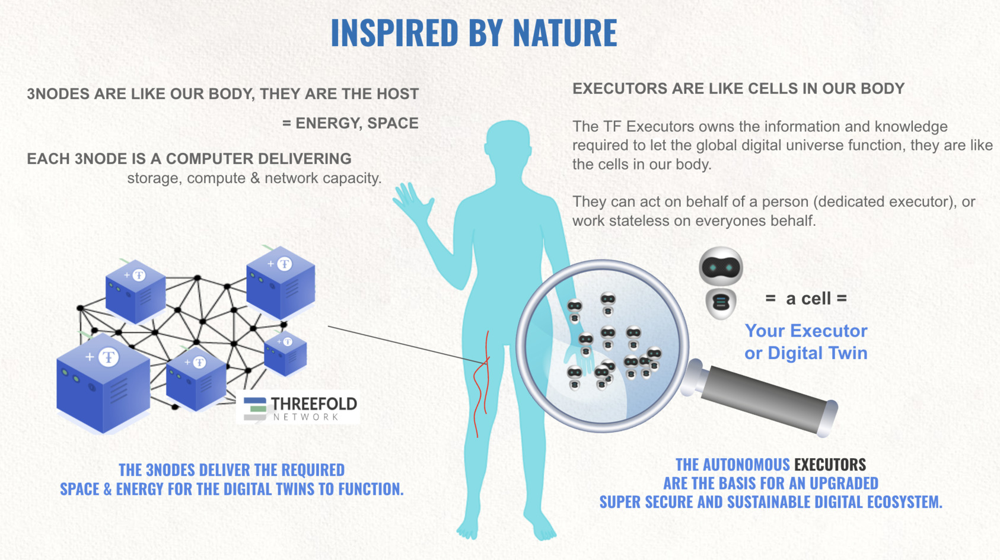
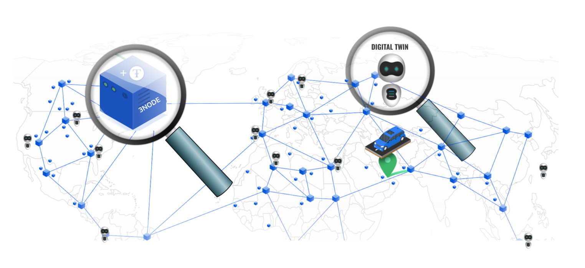
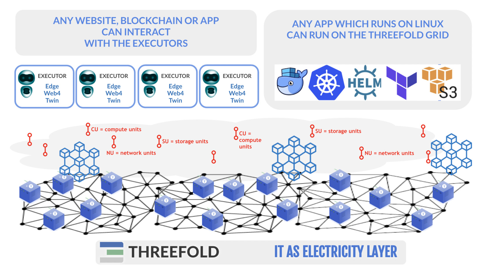

# ThreeFold grid inspired by nature.

- Just like we have trillions of cells in our body, so can billions of twins live next to each other.
- Each twin has memory, knows how to communicate, has knowledge, history, ...
- Twins like cells cannot live without a body = TFGrid.

## This approach scales for ever

- There can be unlimited amounts of 3Nodes as well as Executors (Digital Twins and Web4).
- There are no bottlenecks nor centralization points.
- Our peer2peer network technology takes care of routing and security issues between the Twins and the 3Nodes. The shortest paths is always looked for.

## ThreeFold is compatible with current IT world.

While we push for a new possible in mean time our TFGrid infrastructure is compatible with the exiting IT and internet ecosystem.

- any workload which can run inside linux can run on top of our TFGrid.
- any web developer can create apps (experiences) on top of the Digital Twin.
- just like kwatth is used as a measurement of capacity for solar panels we have [CU](cloudunits), [SU](cloudunits) and [NU](cloudunits).
- TFT is required to buy CU,SU,NU.