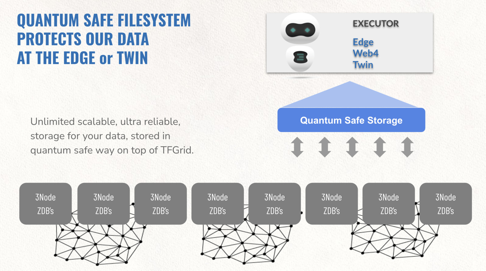

### Unique storage architecture for the executors

Each executor (twin or web4) can now store data which can never be lost.

> based on QSSS

- Not based on replication or blockchain!
- your data is spread over the TFGrid in such a way that not even a quantum computer can hack it. 
- The data is 100% owned by you and zero-knowledge proof to the the TFGrid.

This provides for a super strong storage layer for the TFExecutor in the form of web4 or digital twin. 
