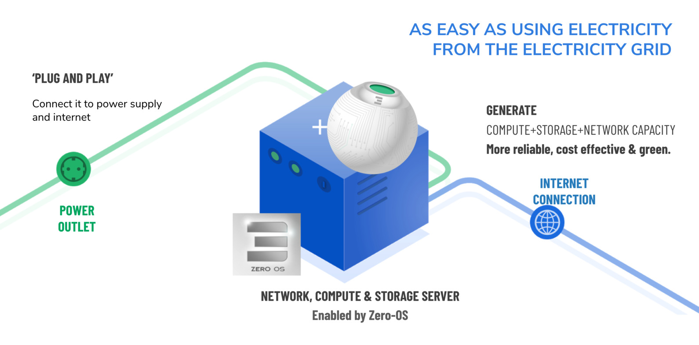
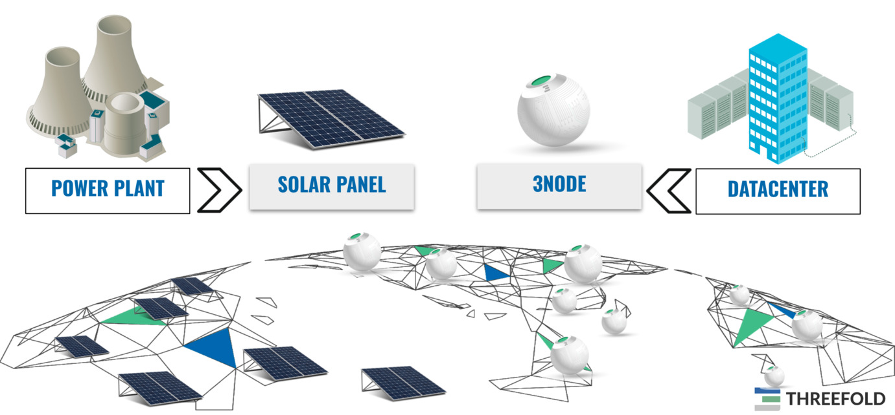

### The ThreeFold Grid Provides the IT energy

Each 3Node is an IT Power generator. The TFGrid is the network of these 3Nodes.

Needs to be super simple, just like a solar panel generates electricity.

- The 3nodes do for internet what solar panels do for large scale electricity power plants.
- They allow everyone to contribute to a new internet.
- People investing in the 3nodes are called [farmers](farming_home).
- Each farmer receives tokens called TFT for providing this IT capacity.
- IT Capacity is storage, compute and network capacity for this upgraded internet.
- The Twins need TFT to pay for the IT capacity they need.

## Link to blockchain

While the twin is a better alternative than the blockchain for many protocols, certain tasks still require a blockchain like

- money
- smart contract between people
- consensus between lots of people around info
- proof of authority, authentication, ...
- reputation system

Each twin can talk to any required blockchain in a way how its 100% transparent for the user.

The Twin can also talk to the classic internet.

Each Twin knows how to talk legacy protocols like SMTP, POP3, DNS, ... (in development) to allow seamless integration.

In case more compute is required for a specific usecase like gaming, AI, data processing the twin can spin up compute & storage requirements on the TFGrid and as such become way more powerful for the time required.

This leads to huge flexibility and efficiency.