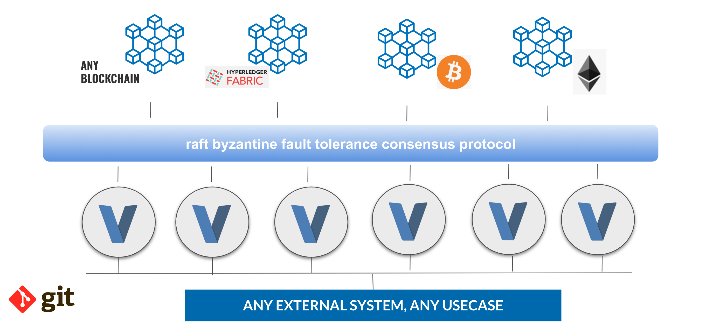

# OurLedger Architecture

  

Multiple VLang engines become the validators of this system. Each VLang engine runs sort of smart contract code and will integrate with the blockchain through the consensus layer.

Only once the consensus is achieved, the result of the code will result in change in the real world (e.g. a blockchain), this allows for a lot of flexibility.

The blockchain is needed to support authentication, money transactions, multi signature, auditing records, ... 

This approach is designed to be compatible with ± all existing blockchain technologies, although some are more efficient than others.

### Benefits

- order of magnitude faster development
- Integrates with everything, easy to extend
- 100% sovereign (can be deployed anywhere)
- Unlimited Scalable, uses Quantum Safe Storage System
- Works with unlimited amount of blockchains and over all protocols 
- Super safe, only needs the most basic functionanalities from a blockchain
- No limite in what can be created
- Actor based

### The developer has unified DSL for

- Blockchain 
- NFT
- Money
- Identity
- Consensus
- Ledger
- Internet Protocols
- SMS, Mail, Chat…
- Deployment of Web 2 and 3 workloads

A DSL can be created for everything.
