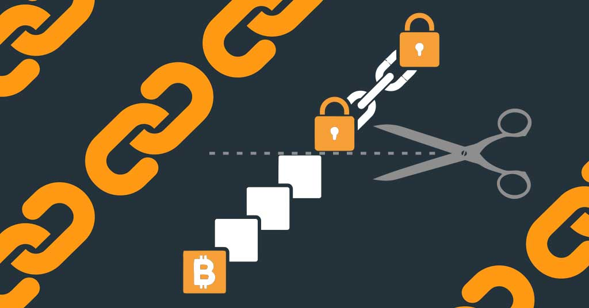

# Blockchain Pruning

  

Existing blockchains don’t have a pruning feature, which means old data cannot get archived, this leads to very large blockchains rather quickly. We have developed a technology which can enable any chosen blockchain and allow old data to be parked on the Quantum Safe Storage system (means can never be corrupted or lost). It means only active data remain on the online chain, this allows for much more scalability and better utilization of the hardware.

To do effective pruning we need to modify parts of the chosen blockchain, but we know how to do this.