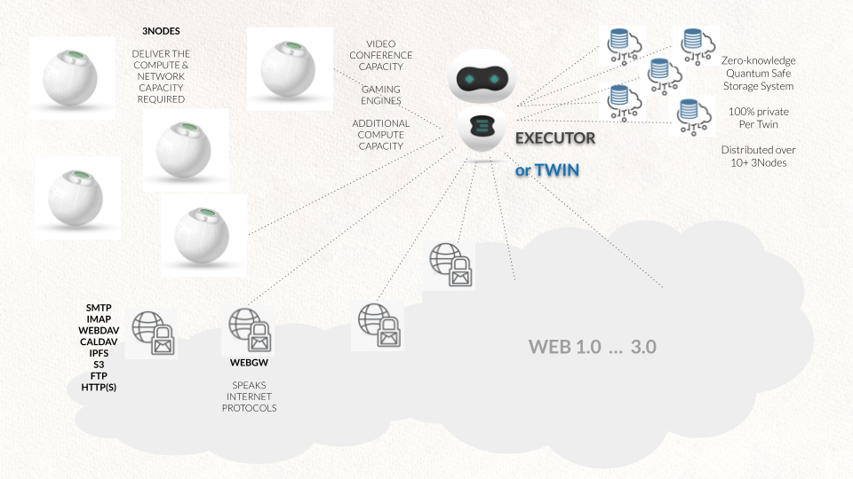

# Compatible with Blockchain & Legacy Systems

The Twins can connect to any blockchain solutions, theey are close to the twins which are on safe locations where full blockchain nodes are deployed, this leads to even more security. In other words, it's not the browser of the user who connects to the blockchain, the browser of the user connects over the Browser Firewall to the apps running on the twin which connects the blockchain. Hackers have no possibility to abuse javascript or browser vulnerabilities.

This is also compatible with any other classic IT system running behind firewalls in protected environments. The Twins can connect to any possible IT system, blockchain or classic in an ultra secure setting.