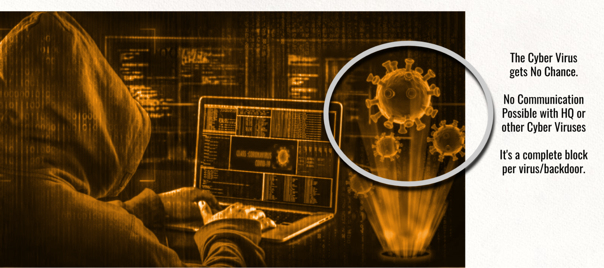

## Secure Access Mechanism = Browser Firewall

For ultra secure use cases, the user doesn't use javascript in his browser, he connects over an ultra secure end2end encrypted and multi authenticated link from his browser to a secure location. In the secure location, the secure browser engine gives access to the required web and banking applications which connect further.

As an option, the web sessions can be recorded for auditing or anti-hacking/fraud detection, also in a secure location.

The twin can communicate with other twins, in a close ultra secure context, giving no chance to hackers to interfere. The data is stored on a Quantum Safe Storage system (see further).

This leads to very good protection and ‘Auditing’ opportunities.

Cyber crime will have a much harder time to be successful, way more difficult (we hope impossible).

Even in the very unlikely event a hacker would succeed, he would only interfere with one twin, which means only one customer would be affected!!!  This makes it so much harder for hackers to deploy capital to hack and social engineer their way into a secure environment.
