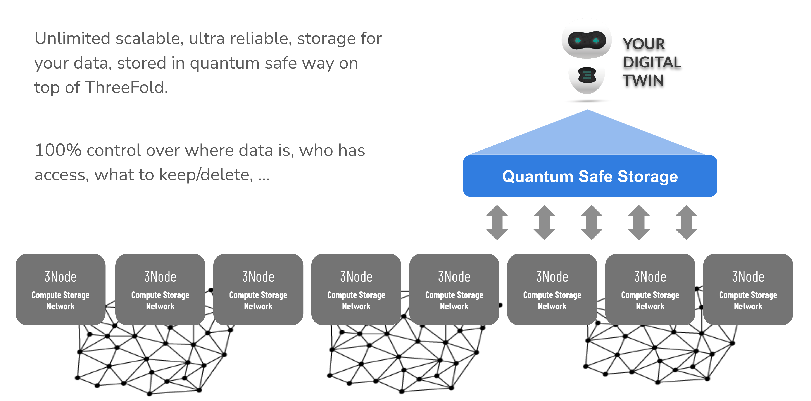

# Quantum Safe Twin Storage System

  

Each Twin or Executor stores the data on a quantum safe filesystem, which means data can never be lost, any application just sees a normal filesystem so it's compatible with any application.

This is an ultra scalable design, there are no limits to the size which can be achieved.

This is a ‘zero knowledge’ proof system which means that, once the data leaves the twin it is impossible for any hacker or even quantum computer to get access or to modify the data, there is simply not enough information available.

A redundant filesystem can store PB’s (millions of gigabytes) of information.

Unique features:

* Unlimited scalable (many petabytes) filesystem
* Quantum Safe: even if used on the ThreeFold Grid, no farmer knows what the data is about
* Even a quantum computer cannot decrypt
* Data can’t be lost
* Protection for datarot, data will auto repair
* Data is kept forever
* Data is dispersed over multiple sites
* Sites can go down, data not lost
* Up to 10x more efficient than storing on classic storage cloud systems
* Can be mounted as a filesystem on any OS or any deployment system (OSX, Linux, Windows, Docker, Kubernetes, ThreeFold Grid, …)
* Compatible with ± all data workloads (not high performance data driven workloads like a database)
* Self-healing: when a node or disk is lost, storage system can get back to the original redundancy level
* Helps with compliance to regulations like GDPR (as the hosting facility has no view on what is stored, information is encrypted and incomplete)
* Hybrid: can be installed onsite, public, private, …