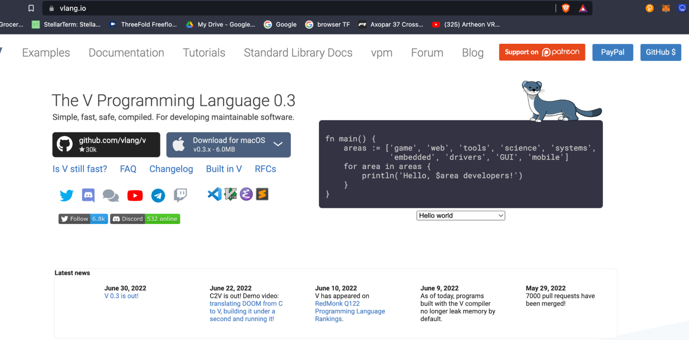

# VLANG Powerful Development Environment

ThreeFold is the main sponsor behind vlang

Vlang is a language heavily inspired by google’s GOLANG but faster and more friendly with resources. It's also a language much easier to understand and code in. This language has 28.000 github stars which is +25% of google itself for golang, this shows the potential.

We use VLANG for

* Digital twin backend (the main language for our digital life)
* Provisioning language for Threefold Grid (in progress)
* Language integrated with our chosen blockchain Algorand (we are close to having a full VLang compatible SDK for Algorand as well as VTeal smart contract language, this will be the easiest way to integrate and develop on top of Algorand)
* Dynamic Executor Language (fastest way to develop peer2peer on top of ThreeFold Grid).  

This Dynamic Executor Language is used in 
    * Digital Twin
    * BCDB = BlockChain Database
    * ThreeFold Grid Executors (serverless functions & compatibility layer for old internet)

This approach allows us maximum productivity and minimal resources utilization which leads to much more power and hardware efficient design.

Our approach is

* Ultimate simplicity (do more with less)
* Easy to read code (DSL  = Domain Specific Languages)
* Ultra reliable communication thanks to RMB (Reliable Message Bus) 
* Safety, only support one best way how to do something
